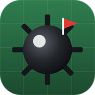
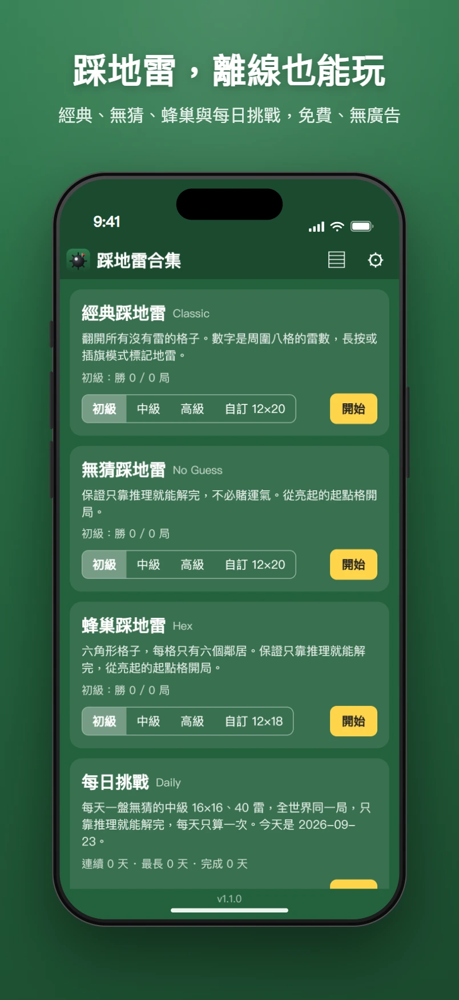
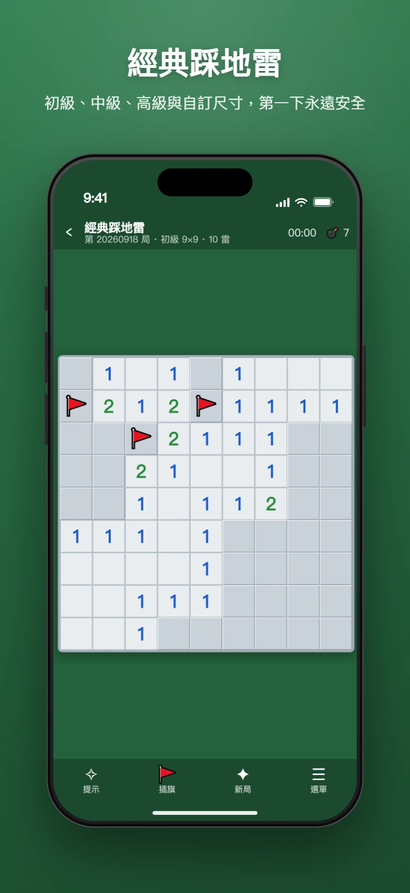
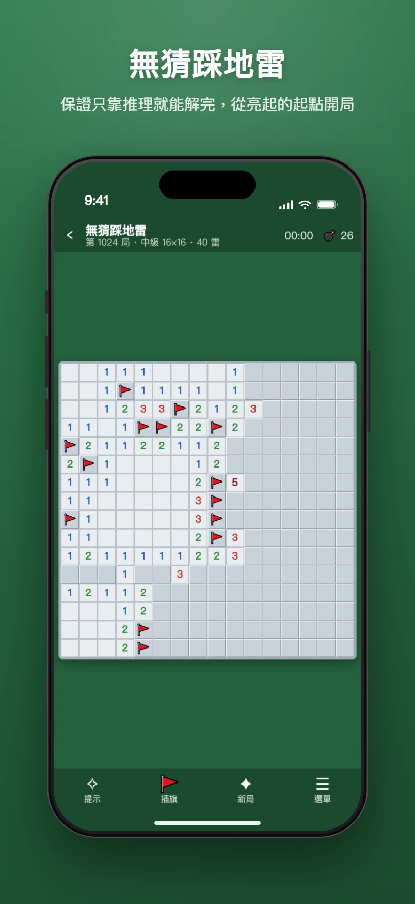
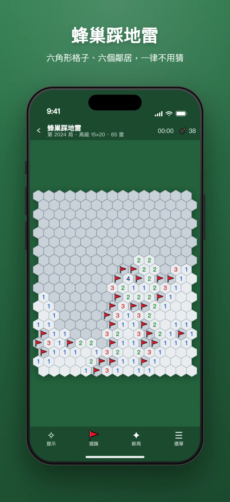
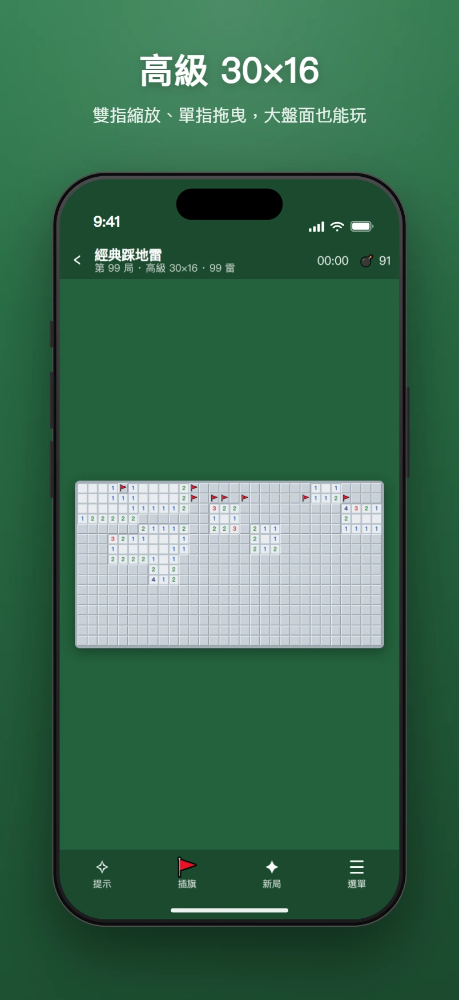
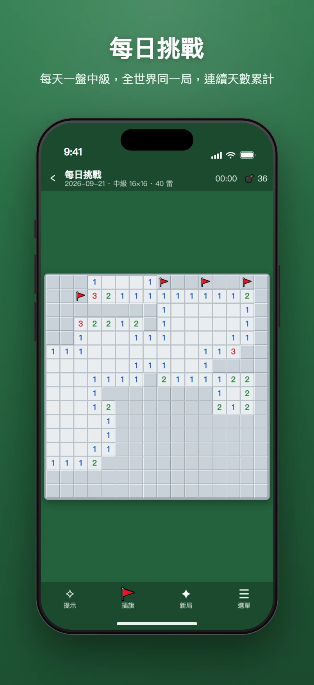
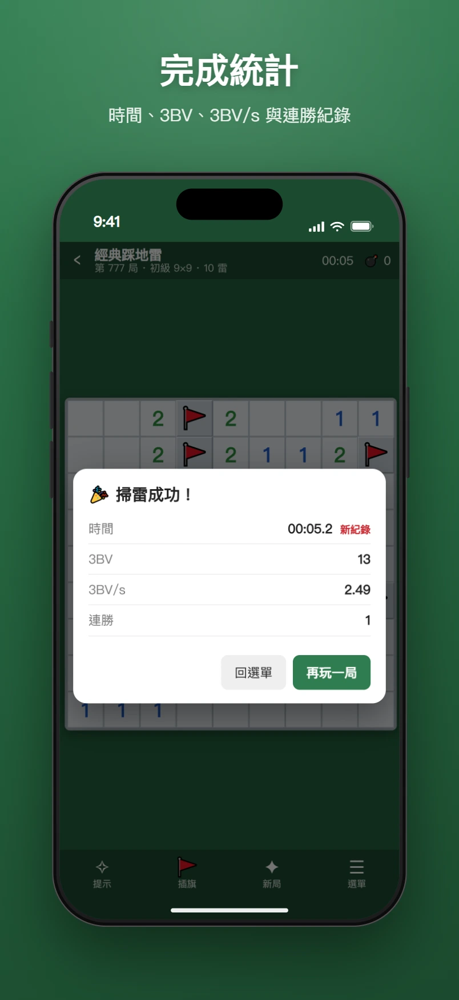
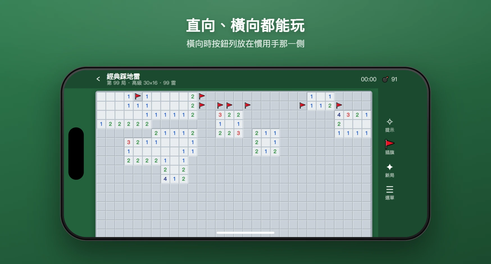

<p align="center">
  
</p>

<h1 align="center">💣 踩地雷合集</h1>

<p align="center">
  <a href="CHANGELOG.md"></a>
  <a href="LICENSE"></a>
  <a href="#-安裝到-iphone"></a>
</p>

<p align="center">免費、無廣告、可離線的網頁踩地雷合集。純 HTML / CSS / JavaScript，零依賴、零建置、零追蹤。<br>加到 iPhone 主畫面後，沒有網路也能玩。</p>

> 🔗 **線上版**：https://muzsor.github.io/minesweeper-collection/
>
> 📋 **變更紀錄**：[CHANGELOG.md](CHANGELOG.md)

## 📑 目錄

- [💣 踩地雷合集](#-踩地雷合集)
  - [📑 目錄](#-目錄)
  - [🎮 遊戲與難度](#-遊戲與難度)
  - [📸 截圖](#-截圖)
  - [✨ 功能](#-功能)
  - [📱 安裝到 iPhone](#-安裝到-iphone)
  - [🛠️ 開發](#️-開發)
  - [🔒 隱私](#-隱私)
  - [📄 授權](#-授權)

---

## 🎮 遊戲與難度

| 遊戲 | 難度選項 | 紀錄 |
|---|---|---|
| 💣 **經典踩地雷** Classic | 初級 9×9 / 中級 16×16 / 高級 30×16 / 自訂，與 Windows 相同 | 每個難度各自的最佳時間、勝率、連勝，完成時顯示 3BV |
| 🧠 **無猜踩地雷** No Guess | 同上，自訂雷數最多格子數的 21% | 與經典分開記錄 |
| 🐝 **蜂巢踩地雷** Hex | 六角格、一律無猜：初級 8×8 / 中級 10×15 / 高級 15×20 / 自訂 | 各自記錄 |
| 📅 **每日挑戰** Daily | 固定無猜中級，每天一盤，全世界同一局 | 連續天數、完成天數 |

難度可在首頁卡片或設定頁切換，下一局生效，每個模式各自記住。每一盤都有局號，從遊戲選單可以複製或輸入局號，同模式、同難度、同局號就是同一盤，可以和朋友比誰快。每日挑戰的盤面由日期算出，離線也是同一盤。

無猜盤面保證只靠推理就能從頭解到尾，任何時候都至少有一格能確定，不會遇到只能賭運氣的二選一。開局前會標出一格起點，從那裡開始。

蜂巢盤面的格子是六角形，每格只有六個鄰居。難度的格數與雷數參考網路上常見的六角踩地雷，排成長方形。

盤面比畫面寬很多時，例如直向手機開 30×16 的高級，盤面會自動轉 90 度排成直的，整盤放得進畫面。只轉排列，數字永遠是正的。

---

## 📸 截圖

首頁與遊戲畫面（iPhone 直向），以及轉成橫向後的排版。

<p align="center">
  
  
  
  
</p>
<p align="center">
  
  
  
</p>
<p align="center">
  
</p>

---

## ✨ 功能

- 👆 點一下翻開、長按插旗、點數字一次翻開周圍（chord）、底部按鈕切換插旗模式；電腦上和 Windows 經典版一樣左鍵翻開、右鍵插旗
- 🔎 長按已翻開的數字（電腦上滑鼠停在數字上），用黃色標出它算的範圍
- 🛡️ 經典模式第一下永遠不會踩雷（踩到的雷會搬到第一個空格，與 Windows 相同）
- 🧠 無猜模式：保證只靠推理就能解完，從標示的起點開局；盤面在背景產生，高級也不到一眨眼
- 🐝 蜂巢模式：六角形格子、每格六個鄰居，一律無猜
- 💡 提示：一次一步完整推理（單一數字、相鄰數字比較、配合剩餘雷數）。確定安全的格子綠色閃爍；確定是雷的格子紅色閃爍並自動插旗。不信任插錯的旗；找不到就明說得猜
- 📅 每日挑戰：無猜中級，seed 由日期算出，全世界同一盤，連續完成天數會累計
- 🔍 盤面可單指拖曳、雙指縮放（只縮棋盤，標題列與按鈕列不動），桌機用 Ctrl + 滾輪
- 💾 每款各自存檔，切換或關閉後再開都能繼續，連復原歷史也保留
- ↩️ 設定裡可開「允許復原」，踩雷也能救回（休閒玩法）
- 📊 每個模式、每個難度各自的局數、勝率、最佳時間、連勝；完成時顯示 3BV 與 3BV/s
- 🔢 每盤都有局號，選單可複製或輸入局號，和朋友玩同一盤
- 🔄 直向、橫向都可玩，轉向自動重排；盤面比畫面寬很多時自動轉 90 度，數字保持正的
- 🎨 慣用手（橫向時按鈕列放哪一側）、桌面顏色、問號標記、音效、震動、計時器
- 📖 中文規則說明
- 💾 統計與設定可匯出成一段文字備份，換手機貼回即可還原
- 📱 PWA 離線快取，有新版本時提示更新，不打斷遊戲

---

## 📱 安裝到 iPhone

1. 用 Safari 開線上版網址
2. 點下方「分享」→「加入主畫面」
3. 第一次在有網路時開一次，之後離線也能玩

加入主畫面後是全螢幕、沒有網址列，也不會有 Safari 雙擊放大的問題。

---

## 🛠️ 開發

純前端、零依賴、零建置步驟。

| 檔案 | 用途 |
|---|---|
| `index.html` | 頁面結構 |
| `css/style.css` | 樣式：排版、棋盤、對話框 |
| `js/app.js` | 畫面流程、設定、統計、存檔、每日挑戰 |
| `js/engine.js` | 共用引擎：步驟提交、復原、動作日誌與重播、存檔 |
| `js/board.js` | 棋盤模型：方格與六角格的鄰居、佈雷、翻開、洪水填充、插旗、chord、3BV |
| `js/solver.js` | 求解器（單格、兩格、全域計數）與無猜盤面產生器 |
| `js/noguess-worker.js` | 在背景執行緒產生無猜盤面 |
| `js/render.js` | 棋盤繪製與觸控：方格用 CSS grid、六角格用 SVG；點、長按、右鍵、拖曳、縮放、自動直轉 |
| `js/games/classic.js` | 經典踩地雷的難度與規則 |
| `js/games/noguess.js` | 無猜踩地雷：沿用經典規則，換成無猜盤面與起點格 |
| `js/games/hex.js` | 蜂巢踩地雷：沿用無猜，換成六角格與另一組難度 |
| `js/rules.js` | 中文規則說明 |
| `js/rng.js` | 隨機數、局號、每日挑戰 seed |
| `sw.js` | Service Worker 離線快取 |
| `version.js` | 版本號，頁面與 Service Worker 共用 |
| `manifest.webmanifest` | PWA 設定 |
| `tests.html` | 單元測試（瀏覽器直接開） |
| `scripts/icons.html` | 圖示產生器（瀏覽器直接開，下載 PNG） |
| `scripts/screenshots.mjs` | 截圖產生器：無頭 Chrome 擷圖並套上 `screenshots-frame.html` 的 iPhone 外框 |
| `docs/screenshots/` | README 用的截圖，由上面的腳本產生 |

<details>
<summary>🚀 本機啟動</summary>

需要 Node.js 18 以上（只用來跑開發伺服器，遊戲本身不需要）。

```bash
npm run dev
# 開 http://localhost:8125/
```

同一個 Wi-Fi 的手機要連進來測試：

```bash
npm run dev:lan
# 終端機會印出手機可用的網址
```

本機模式下 Service Worker 不會快取，改完程式重新整理即可。

</details>

<details>
<summary>🔢 發布新版本</summary>

1. 改 `version.js`：功能有變動就升 `APP_VERSION`，任何部署都把 `APP_BUILD` 加一
2. 在 [CHANGELOG.md](CHANGELOG.md) 記錄變更
3. 推上去後，已安裝的使用者下次開啟會看到「有新版本可用」

`APP_BUILD` 同時決定 Service Worker 的快取名稱與首頁底部顯示的版本，只需要改這一個檔。

</details>

<details>
<summary>💾 存檔格式</summary>

存檔只記「種子、難度、每一步的動作」，重開時用同一個種子佈雷再重播，所以整局只有幾 KB，復原歷史也完整保留。另存一份最終狀態當校驗：若日後規則改版導致重播結果不同，就直接採用該狀態，只是失去復原的能力。

無猜盤面另外把起點與雷位存成一段字串（高級約 300 字元），重開與回到開頭都直接用，不必重新產生。同一個局號重新產生也會得到同一盤，但若日後改了產生演算法，舊局號對應的盤面可能會變。

</details>

<details>
<summary>🧪 單元測試</summary>

開 http://localhost:8125/tests.html 就會執行並列出結果，涵蓋：隨機數與每日 seed、佈雷、第一下搬雷、洪水填充、插旗、chord、3BV、勝負、存檔重播、提示、求解器三層推論、無猜盤面的可重現性與可解性、六角格的鄰居與蜂巢盤面。

</details>

<details>
<summary>🎨 重新產生圖示</summary>

圖示是 `icons/icon.svg`。用瀏覽器開 `scripts/icons.html` 下載四張 PNG 放回 `icons/`。512 的兩張也可以用 Chrome 無頭模式產生：

```bash
chrome --headless=new --default-background-color=00000000 --window-size=512,512 --screenshot=icons/icon-512.png "http://localhost:8125/scripts/icons.html?only=icon-512.png"
```

180 與 192 不能這樣截：無頭 Chrome 的視窗最小約 500px 寬，圖會被切掉。請用頁面上的下載連結，或由 512 那張縮小。180 那張是 iPhone 主畫面用的，要滿版不透明，iOS 會自己裁圓角。

</details>

<details>
<summary>📸 重新產生截圖</summary>

需要本機有 Chrome 或 Edge，Node 20.10 以上。

```bash
npm run screenshots
```

會啟動無頭 Chrome，模擬 iPhone（402×874 pt、獨立模式）開首頁與各遊戲畫面擷圖，再套上 `scripts/screenshots-frame.html` 的外框、狀態列與標題，輸出到 `docs/screenshots/*.webp`。盤面用固定局號，重跑結果一樣；每日挑戰的盤面由當天日期決定，換一天重跑會不同。

- 只重出幾張：`npm run screenshots -- home classic`
- 同時輸出 PNG：`npm run screenshots -- --png`
- 標題、副標、局號與翻開的格數在 `scripts/screenshots.mjs` 的 `SHOTS`；外框、背景色在樣板檔裡改
- 找不到瀏覽器時用環境變數 `CHROME` 指定執行檔

</details>

<details>
<summary>🧩 新增一款遊戲</summary>

1. 在 `js/games/` 新增檔案，繼承 `js/engine.js` 的 `Game`，用 `js/board.js` 的 `Board` 或自己的盤面模型，實作 `init`、`extraState`、`restoreExtra`、`isWon`、`isLost`、`applyAction`
   規則參考 `classic.js`；只換盤面產生方式的變體可以像 `noguess.js` 一樣繼承 `Classic`、覆寫 `layMines`；只換格形與難度的變體可以像 `hex.js` 一樣覆寫 `shape` 與 `levels`
2. 加到 `js/games/index.js` 的 `GAMES` 陣列，並在 `js/app.js` 的 `MODES` 加一筆（難度設定鍵、統計鍵），首頁就會多一張卡片
3. 在 `js/rules.js` 加中文規則，在 `sw.js` 的 `ASSETS` 加上新檔案路徑

</details>

---

## 🔒 隱私

- 🚫 沒有任何網路請求、analytics、cookies
- 🚫 沒有第三方 CDN，字型與音效都不用外部資源
- ✅ 存檔與統計只存在自己瀏覽器的 localStorage
- ✅ Service Worker 只快取同源檔案

---

## 📄 授權

[MIT](LICENSE)
